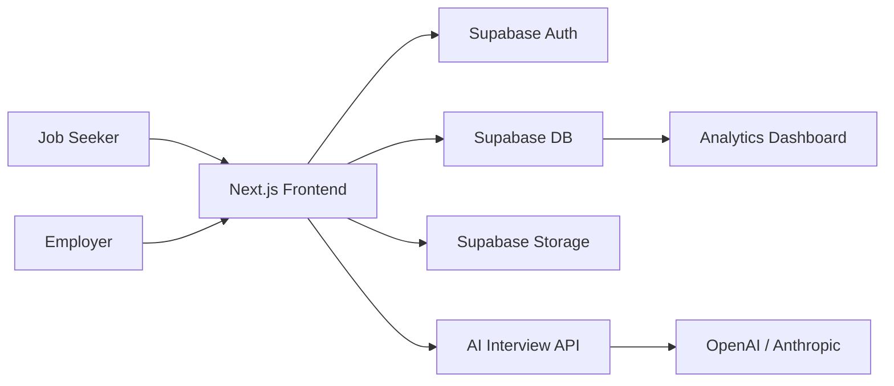

# AI-Powered Niche Job Board & Curated Directory

## 1. Product Vision

A modern, high-conversion hiring platform that helps:
- Job seekers discover relevant opportunities quickly, apply with one click, and complete AI-powered screening interviews.
- Employers publish curated job openings, review candidates, and make faster hiring decisions with interview analytics.

The experience should feel fast, trustworthy, and highly scannable, with a three-column job board and an interview flow that feels conversational rather than robotic.

---

## 2. Recommended Technical Stack

### Frontend
- Next.js 14+ (App Router)
- TypeScript
- Tailwind CSS
- shadcn/ui
- Framer Motion (optional for subtle transitions)

### Backend / API
- Next.js Route Handlers
- Supabase Postgres
- Supabase Auth
- Supabase Storage for resumes and logos

### AI Layer
- OpenAI GPT-4o or Anthropic Claude
- Vercel AI SDK for streaming chat UX
- Optional: Whisper for voice-to-text transcription

### Infra / Deployment
- Vercel for frontend and serverless API
- Supabase for database/auth/storage
- Resend or Postmark for email
- S3-compatible storage if needed for larger assets

---

## 3. Core Architecture



### Key Modules
- Auth Module
- User Profile Module
- Jobs Directory Module
- Application Module
- AI Interview Module
- Employer Dashboard Module
- Admin / Moderation Module

### User Roles
- Job Seeker
  - Sign up/login via Google or email
  - Create profile with resume, skills, experience
  - Browse jobs
  - Start AI interview
  - View interview history

- Employer
  - Sign up/login via Google or email
  - Create company profile
  - Publish jobs
  - Review applicants and AI scores
  - Track interview analytics

---

## 4. UX / UI Blueprint

### Main Job Board Layout
A responsive 3-column layout:

- Column 1: Filter sidebar
  - Job type: Full-time, Remote, Contract, Part-time
  - Experience level
  - Salary range
  - Location
  - Skills tags

- Column 2: Live job feed
  - Scrollable list of job cards
  - Each card includes:
    - Title
    - Company name
    - Salary tag
    - Tech stack tags
    - Easy Apply button
    - Posted time

- Column 3: Quick-view panel
  - Dynamically loads on selection
  - Includes:
    - Full job description
    - Requirements
    - Company profile
    - Start AI Screening Interview button

### Design Principles
- High scannability
- Low cognitive load
- Strong visual hierarchy
- Fast interactions
- Mobile-first responsive layouts

### Recommended Component Structure
- App shell
- Navbar
- FilterSidebar
- JobFeedList
- JobCard
- JobDetailPanel
- InterviewModal or InterviewPage
- EmployerDashboard
- UserProfilePanel

---

## 5. Database Schema

### Core Design Goals
- One user may have one role or both roles
- Jobs belong to employers
- Applications connect seekers to jobs
- Each AI interview belongs to one application and one job
- Resume and company logo stored securely in object storage

### SQL Schema (PostgreSQL / Supabase)

```sql
create extension if not exists "uuid-ossp";

create type user_role as enum ('job_seeker', 'employer', 'admin');
create type job_type as enum ('full_time', 'remote', 'contract', 'part_time');
create type experience_level as enum ('entry', 'mid', 'senior', 'lead');
create type application_status as enum ('draft', 'submitted', 'screening', 'interviewed', 'rejected', 'hired');
create type interview_status as enum ('pending', 'in_progress', 'completed', 'failed');
create type recommendation as enum ('strongly_recommend', 'recommend', 'proceed_with_caution', 'not_recommend');

create table users (
  id uuid primary key default uuid_generate_v4(),
  auth_user_id uuid unique not null,
  email text unique not null,
  full_name text,
  avatar_url text,
  role user_role not null default 'job_seeker',
  created_at timestamptz default now(),
  updated_at timestamptz default now()
);

create table companies (
  id uuid primary key default uuid_generate_v4(),
  owner_user_id uuid references users(id) on delete cascade,
  name text not null,
  slug text unique not null,
  description text,
  website_url text,
  logo_url text,
  location text,
  created_at timestamptz default now(),
  updated_at timestamptz default now()
);

create table seeker_profiles (
  id uuid primary key default uuid_generate_v4(),
  user_id uuid references users(id) on delete cascade unique,
  headline text,
  bio text,
  resume_url text,
  resume_text text,
  skills text[],
  experience_years int default 0,
  preferred_location text,
  created_at timestamptz default now(),
  updated_at timestamptz default now()
);

create table jobs (
  id uuid primary key default uuid_generate_v4(),
  employer_user_id uuid references users(id) on delete cascade,
  company_id uuid references companies(id) on delete cascade,
  title text not null,
  slug text unique not null,
  description text not null,
  requirements text not null,
  job_type job_type not null,
  experience_level experience_level not null,
  salary_min int,
  salary_max int,
  location text,
  remote boolean default false,
  is_active boolean default true,
  tags text[],
  created_at timestamptz default now(),
  updated_at timestamptz default now()
);

create table applications (
  id uuid primary key default uuid_generate_v4(),
  job_id uuid references jobs(id) on delete cascade,
  seeker_user_id uuid references users(id) on delete cascade,
  status application_status not null default 'submitted',
  cover_letter text,
  applied_at timestamptz default now(),
  updated_at timestamptz default now(),
  unique(job_id, seeker_user_id)
);

create table ai_interviews (
  id uuid primary key default uuid_generate_v4(),
  application_id uuid references applications(id) on delete cascade unique,
  job_id uuid references jobs(id) on delete cascade,
  seeker_user_id uuid references users(id) on delete cascade,
  employer_user_id uuid references users(id) on delete cascade,
  status interview_status not null default 'pending',
  transcript text,
  questions jsonb default '[]'::jsonb,
  score numeric(5,2),
  tech_competency_rating numeric(5,2),
  pros text[],
  cons text[],
  recommendation recommendation,
  evaluation_json jsonb,
  created_at timestamptz default now(),
  updated_at timestamptz default now()
);
```

### Relationship Summary
- users → companies: one employer can own many companies
- users → seeker_profiles: one profile per seeker
- users → jobs: one employer publishes many jobs
- jobs → applications: one job has many applications
- users → applications: one seeker has many applications
- applications → ai_interviews: one application can have one interview result

---

## 6. API and Backend Design

### Recommended Route Structure
- /api/auth/*
- /api/jobs
- /api/jobs/[id]
- /api/applications
- /api/interviews/start
- /api/interviews/[id]/message
- /api/interviews/[id]/complete
- /api/dashboard/employer
- /api/dashboard/seeker

### Recommended Service Layer
- auth.service.ts
- jobs.service.ts
- applications.service.ts
- interviews.service.ts
- storage.service.ts
- resume-parser.service.ts

### Resume Parsing Flow
1. Upload PDF to Supabase Storage
2. Extract text using a parser or OCR service
3. Store parsed text in seeker_profiles.resume_text
4. Use that text as context for AI interview generation

---

## 7. AI Interviewer Workflow

### Core UX
- User clicks Start AI Screening Interview from the quick-view panel
- System loads the selected job description and candidate resume
- AI asks one question at a time
- Candidate answers via text or voice-to-text
- After 4 turns, the system evaluates the response

### Interview Logic
- The AI uses only the job requirements and the resume as grounding context
- It should not stray from the role requirements
- Each interview should have a strict structure:
  1. Behavioral fit question
  2. Technical competency question
  3. Problem-solving or ownership question
  4. Culture / communication / collaboration question

### Structured Evaluation Output
```json
{
  "overall_match_score": 86,
  "tech_competency_rating": 82,
  "pros": [
    "Strong alignment with backend architecture experience",
    "Clear ownership and delivery examples"
  ],
  "cons": [
    "Limited direct experience with distributed systems",
    "Resume lacks explicit cloud-native deployment examples"
  ],
  "recommendation": "recommend",
  "summary": "Candidate shows strong relevance for the role and is a good fit for the team."
}
```

### Example Backend Flow
```ts
// app/api/interviews/start/route.ts
import { NextRequest, NextResponse } from 'next/server';
import { createClient } from '@/lib/supabase/server';
import { generateInterviewPlan, evaluateInterview } from '@/lib/ai/interview';

export async function POST(req: NextRequest) {
  const supabase = createClient();
  const { jobId, seekerUserId } = await req.json();

  const { data: job } = await supabase
    .from('jobs')
    .select('*')
    .eq('id', jobId)
    .single();

  const { data: profile } = await supabase
    .from('seeker_profiles')
    .select('*')
    .eq('user_id', seekerUserId)
    .single();

  const questions = await generateInterviewPlan({
    jobDescription: job.description,
    requirements: job.requirements,
    resumeText: profile.resume_text ?? '',
  });

  const { data: interview } = await supabase
    .from('ai_interviews')
    .insert({
      job_id: jobId,
      seeker_user_id: seekerUserId,
      status: 'in_progress',
      questions,
    })
    .select()
    .single();

  return NextResponse.json({ interview, questions });
}
```

### Recommended AI Prompt Strategy
- System prompt: act as a structured recruiter and maintain fairness
- Context prompt: include job description, requirements, and resume summary
- Keep prompts deterministic and constrained to JSON output for evaluation

---

## 8. Frontend Implementation Plan

### Page Structure
- /signin
- /signup
- /dashboard/seeker
- /dashboard/employer
- /jobs
- /jobs/[slug]
- /interview/[id]
- /applications/[id]

### Key UI Components
- FilterSidebar
- JobFeed
- JobCard
- JobDetailPanel
- InterviewChatPanel
- InterviewQuestionCard
- ScoreBadge
- RecommendationChip
- EmployerApplicantsTable

### Suggested State Management
- Server components for fast initial page loads
- React Query / TanStack Query for fetching and caching job data
- Local state for interview chat flow
- Supabase realtime subscriptions for new applicants and updated analytics

---

## 9. Step-by-Step Implementation Guide

### Phase 1 — Database and Authentication Setup
1. Create Supabase project
2. Enable Google Auth and email auth
3. Create database tables from the schema above
4. Add Row Level Security policies
5. Build auth helpers and user profile creation flow
6. Set up storage buckets for resumes and company logos

### Phase 2 — Job Directory Layout
1. Build the three-column responsive layout
2. Create job listing cards and filter sidebar UI
3. Add server-rendered job detail panel
4. Implement search, sorting, and tag filtering
5. Build employer dashboard with job publishing form

### Phase 3 — AI Interview Integration
1. Create interview session model and API route
2. Generate 4-question structured interview flow
3. Create chat or voice input UI
4. Implement transcript storage
5. Add evaluation endpoint that returns structured JSON
6. Display results in the employer dashboard and seeker history tab

### Phase 4 — Deployment and Optimization
1. Configure Vercel project
2. Connect Supabase and environment variables
3. Enable analytics and error tracking
4. Deploy with image optimization and caching
5. Add monitoring for AI latency and failed interview sessions
6. Test security, uploads, and role-based access

---

## 10. Security Considerations

- Protect all employer-only routes with role checks
- Use server-side authorization, not just frontend gating
- Store resumes in private storage buckets
- Use signed URLs for secure document access
- Sanitize AI-generated content before display
- Rate-limit AI interview endpoints
- Log interview events for auditability

---

## 11. Performance Recommendations

- Use server components where possible
- Pre-render static job list pages where appropriate
- Lazy-load heavy components like interview UI
- Cache job searches and filters with revalidation
- Keep AI prompts compact and structured
- Stream interview responses for a better UX

---

## 12. MVP Scope Recommendation

For an initial market-ready release, build:
- Auth and role-based onboarding
- Seeker profile with resume upload
- Employer company profile and job creation
- Job board with filters and detail panel
- One-click apply and AI interview flow
- Employer dashboard with applicant score summary

This MVP will validate demand quickly while keeping the system modular enough to expand later.

---

## 13. Suggested Folder Structure

```text
src/
  app/
    (auth)/signin/page.tsx
    (auth)/signup/page.tsx
    dashboard/seeker/page.tsx
    dashboard/employer/page.tsx
    jobs/page.tsx
    jobs/[slug]/page.tsx
    interview/[id]/page.tsx
    api/
      jobs/route.ts
      applications/route.ts
      interviews/start/route.ts
      interviews/[id]/message/route.ts
      interviews/[id]/complete/route.ts
  components/
    ui/
    jobs/
    interviews/
    dashboard/
  lib/
    supabase/
    ai/
    services/
  types/
  schemas/
```

---

## 14. Recommended Next Steps

1. Create the Supabase schema and auth flow
2. Build the job board UI shell
3. Add resume upload and profile storage
4. Implement the interview question generation endpoint
5. Add evaluation and score display
6. Deploy and test with a small pilot cohort

This architecture is intentionally modular, scalable, and suitable for rapid iteration while keeping the AI interview experience polished and production-ready.
